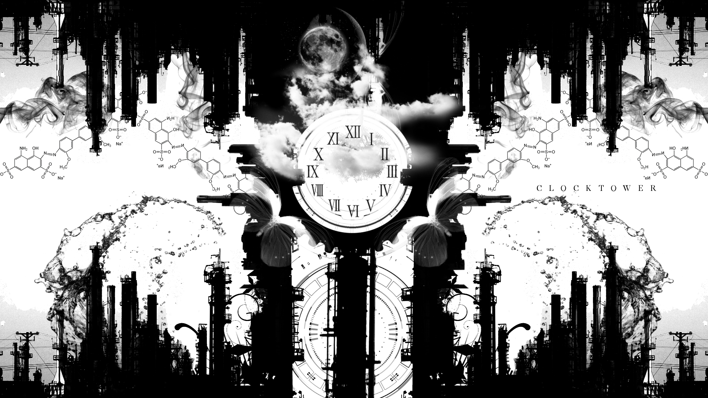
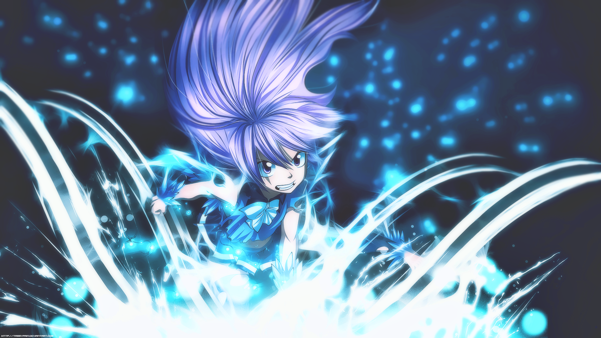

<div align="center">
  
</div>

<div align="center">
  
</div>

---

## ⌨️ System Scan

```bash
┌──(gleb㉿insider)-[~]
└─$ neofetch

      ██████╗   OS       →  Windows 11, heavily customized
      ██╔══██╗  Shell    →  PowerShell + pure curiosity
      ██████╔╝  CPU      →  I5-10400F
      ██╔══██╗  GPU      →  GeForce RTX 5050
      ╚═╝  ╚═╝  RAM      →  32 GB
                Uptime   →  still young, already dangerous
                Mods     →  Minecraft Forge wizard 🧙
```



### 🧬 Operator Profile

```diff
+ speaks: Russian / English (bilingual mode)
+ builds: software · systems · electronics
+ plays: Arduino boards like a guitar
+ mods:  Minecraft Java Edition
```

<br clear="right"/>

---

## 🎮 Character Stats

| SKILL | LVL | PROGRESS |
|---|---|---|
| 🐍 Python | `HIGH` | ▓▓▓▓▓▓▓▓░░ |
| ☕ Java | `HIGH` | ▓▓▓▓▓▓▓░░░ |
| ⚙️ C++ | `MID` | ▓▓▓▓▓▓░░░░ |
| 📟 Arduino | `HIGH` | ▓▓▓▓▓▓▓░░░ |
| ⚛️ React | `LVLING` | ▓▓▓▓░░░░░░ |
| 🦀 Tauri | `LVLING` | ▓▓▓░░░░░░░ |

<p align="center">
  <a href="https://skillicons.dev">
    
  </a>
</p>

---

## 🖥️ System Monitor

<p align="center">
  
  
</p>

---

## ⚡ Active Quests

| QUEST | STATUS | DESCRIPTION |
|---|---|---|
| 🧠 **DevilMod** | `🚀 deployed` | mod for Minecraft Forge 1.20.1 |



```bash
┌──(gleb㉿insider)-[quests]
└─$ cat next_mission.txt
> build things that shouldn't be possible
> break them
> rebuild better
```

<br clear="right"/>

---

## 🐍 Snake Protocol

```bash
┌──(gleb㉿insider)-[~]
└─$ ./release_the_snake --eat=contributions
```

<picture>
  <source media="(prefers-color-scheme: dark)" srcset="https://raw.githubusercontent.com/ProstoInside/ProstoInside/output/github-contribution-grid-snake-dark.svg" />
  
</picture>

---

<div align="center">
  
</div>
